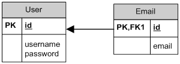

# Grokking Spring Persistence: Representing Object Associations in the Database

> Understanding the different ways in which you can represent the relationships between classes in a relational database

+ Introducing the "Association Type Predictor" table
+ Discussing database representations for *one-to-one*, *one-to-many* and *many-to-many* associations.

## Introduction

The purpose of an ORM (*Object-relational mapping*) framework is to allow you to treat your database as if it would store Java objects. However, databases do not store objects &mdash; they use tables and columns &mdash; so it is important to understand how the associations between objects can be represented in a database.

## The "Association Type Predictor" Method

Given two entities, the following simple method lets you decide the persistence type (i.e. cardinality) of the entity relationships just by answering two simple questions and looking at the table below:


q1: Can Entity2 belong to more than one Entity1?
q2: Can Entity1 have more than one Entity2?

| q1  | q2  | Relationship | UML Representation                                                    |                                                    
|-----|-----|--------------|-----------------------------------------------------------------------|
| No  | No  | One-to-One   |      |
| Yes | No  | Many-to-One  |    |
| No  | Yes | One-to-Many  |    |
| Yes | Yes | Many-to-Many |  |


Note that when your application scenario involves more than two entities, you will have to apply this method to each pair of related entities.


## A. The One-to-One Association

Consider this simple scenario involving a one-to-one relationhip between a User and Email entity.


If we use the *association type predictor* method for this scenario we will have:
q1: Can *Email* belong to more than one *User*? **No**
q2: Can a *User* have more than one *Email*? **No**

Therefore, the relationship depicted above will be a one-to-one relationship. Let's see how this can be represented in the database.

### A1. One-to-One: Single Table

At its simplest, the properties of bot classes can be maintained in the same table:


This can be written using the following SQL script:

```sql
CREATE TABLE `user` (
  id BIGINT NOT NULL AUTO_INCREMENT,
  username VARCHAR(50) NOT NULL,
  password VARCHAR(50) NOT NULL,
  email VARCHAR(50) NOT NULL,
  PRIMARY KEY (id),
  UNIQUE INDEX user_idx_0 (username, password)
);
``` 

Note that an additional unique index is needed in the table so that you don't end up with duplicate *username-email* values.

### A2. One-to-One: Tables Sharing the Primary Key

As an alternative to the previous approach, the entities can be maintained in distinct tables with identical primary keys:



This can be written using the following SQL script:

```sql
CREATE TABLE `user` (
  id BIGINT NOT NULL AUTO_INCREMENT,
  username VARCHAR(50) NOT NULL,
  password VARCHAR(50) NOT NULL
  PRIMARY KEY (id)
);

CREATE TABLE `email` (
  id BIGINT NOT NULL,
  email VARCHAR(50) NOT NULL,
  PRIMARY KEY (id)
);
```

### A3. One-to-One: Distinct Tables

In this option, you use two tables with separate primary keys, and the key for one of the entities is maintained in the other with a *foreign key*. 
This also requires a *unique constraint* applied to the foreign key to prevent a one-to-many relationship.


This can be written using the following script:

```sql
CREATE TABLE `email` (
  id BIGINT NOT NULL AUTO_INCREMENT,
  email VARCHAR(50) NOT NULL,
  PRIMARY KEY (id)
);

CREATE TABLE `user` (
  id BIGINT NOT NULL AUTO_INCREMENT,
  username VARCHAR(50) NOT NULL,
  password VARCHAR(50) NOT NULL,
  email_id BIGINT NULL DEFAULT NULL,
  PRIMARY KEY (id),
  UNIQUE INDEX user_idx_0 (email_id),
  INDEX fk_email_id (email_id),
  CONSTRAINT fk_email_id FOREIGN KEY (email_id) REFERENCES email (id)
);
```

## B. The One-to-Many and Many-to-One Association

Consider this scenario involving the following relationship between a User and an Email entity:


In this case:
q1: Can an *Email* belong to more than one *User*? **No**
q2: Can a *User* have more than one *Email*? **Yes**

Note that a *many-to-one* association is just *one-to-many* association, but seen from the perspective of the other class.

### B1. One-to-Many: Distinct Tables

The simplest way to represent a one-to-many association consists in using a couple of distinct tables with a foreign key defined on the *many* side:


The following script describes this scenario:

```sql
CREATE TABLE `user` (
  id BIGINT NOT NULL AUTO_INCREMENT,
  username VARCHAR(50) NOT NULL,
  password VARCHAR(50) NOT NULL,
  PRIMARY KEY (id)
);

CREATE TABLE `email` (
  id BIGINT NOT NULL AUTO_INCREMENT,
  email VARCHAR(50) NOT NULL,
  user_id BIGINT NOT NULL,
  PRIMARY KEY (id),
  CONSTRAINT fk_user_id FOREIGN KEY (user_id) REFERENCES user (id)
);
```


### B2. One-to-Many: Link Table

The one-to-many relationship can also be backed by a link table. This link table maintains a foreign key for each of the associated table, which will itself form the primary key of the table.


This arrangement can be represented in SQL with the following script:

```sql
CREATE TABLE `user` (
  id BIGINT NOT NULL AUTO_INCREMENT,
  username VARCHAR(50) NOT NULL,
  password VARCHAR(50) NOT NULL,
  PRIMARY KEY (id)
);

CREATE TABLE `email` (
  id BIGINT NOT NULL AUTO_INCREMENT,
  email VARCHAR(50) NOT NULL,
  PRIMARY KEY (id)
);

CREATE TABLE `user_email` (
  user_id BIGINT NOT NULL,
  email_id BIGINT NOT NULL,
  PRIMARY KEY (user_id, email_id),
  CONSTRAINT fk_user_id FOREIGN KEY (user_id) REFERENCES user (id),
  CONSTRAINT fk_email_id FOREIGN KEY (email_id) REFERENCES email (id)
);
```

| Notes |
|-------|
| A unique constraint must be applied to the *many* side of the relationship to prevent a many-to-many association between Users and Emails |
| Additional columns can be added to the link table to maintain extra information about the relationship (e.g. the ordering for primary and secondary emails) |


## C. The Many-to-Many Association

Consider this scenario involving the relationship between a User and an Email entity:


q1: Can an Email belong to more than one *User*? **Yes**
q2: Can a *User* belong to more than one *Email*? **Yes**

### C1. Many-to-Many: Link Table

A many-to-many relationship can be represented by a table linking User and Email (the same solution used in [B2. One-to-Many: Link Table](#b2-one-to-many-link-table) but dropping the unique constraint used in the many side).


The following script creates this arrangement:

```sql
CREATE TABLE `user` (
  id BIGINT NOT NULL AUTO_INCREMENT,
  username VARCHAR(50) NOT NULL,
  password VARCHAR(50) NOT NULL,
  PRIMARY KEY (id)
);

CREATE TABLE `email` (
  id BIGINT NOT NULL AUTO_INCREMENT,
  email VARCHAR(50) NOT NULL,
  PRIMARY KEY (id)
);

CREATE TABLE `user_email` (
  user_id BIGINT NOT NULL,
  email_id BIGINT NOT NULL,
  PRIMARY KEY (user_id, email_id),
  CONSTRAINT fk_user_id FOREIGN KEY (user_id) REFERENCES user (id),
  CONSTRAINT fk_email_id FOREIGN KEY (email_id) REFERENCES email (id)
);
```

Note that these tables won't allow the same *User* to have the same *Email* twice, as this would require compound primary key to be duplicated. If you need that, see the following section.

### C2. Many-to-Many: Link Table with Primary key

A many-to-many relationship can also be represented as a small variant on [C1. Many-to-Many: Link Table](#c1-many-to-many-link-table) on which the link table features its own primary key (usuarlly a surrogate key). That would allow the same *User* to be associated more than once to the same *Email* entity more than once.


```sql
CREATE TABLE `user` (
  id BIGINT NOT NULL AUTO_INCREMENT,
  username VARCHAR(50) NOT NULL,
  password VARCHAR(50) NOT NULL,
  PRIMARY KEY (id)
);

CREATE TABLE `email` (
  id BIGINT NOT NULL AUTO_INCREMENT,
  email VARCHAR(50) NOT NULL,
  PRIMARY KEY (id)
);

CREATE TABLE `user_email` (
  id BIGINT NOT NULL,
  user_id BIGINT NOT NULL,
  email_id BIGINT NOT NULL,
  PRIMARY KEY (id),
  CONSTRAINT fk_user_id FOREIGN KEY (user_id) REFERENCES user (id),
  CONSTRAINT fk_email_id FOREIGN KEY (email_id) REFERENCES email (id)
);
```
