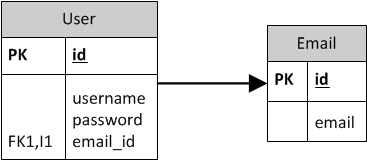

# Grokking Spring Persistence: Using JPA for modeling Entity Relationships

> annotating your Java classes for modeling Entity Relationships

+ Annotating one-to-one associations
+ Annotating one-to-many and many-to-one-associations
+ Annotating many-to-many associations

## Introduction

An application needs a persistence layer to maintain information its state in a database. One way to achieve that is through metadata annotations on your domain model classes. Those annotation will then be interpreted by the Java Runtime Environment (JRE) and the JPA (Java Persistence API) framework to effectively map the relationship between your objects and the tables in the relational database.

## A. Mapping One-to-One Associations

Let's consider the scenario for a one-to-one relationship between a User and an Email:


### A1. One-to-One: Mapping an Embedded One-to-One Association

An embedded one-to-one association uses one table to represent both entities:


When all the fields of one entity are maintained within the same table as another, the enclosed entity is referred to as an embedded entity in JPA terminology.

The `@Embedded` annotation is used to manage this relationship, and it requires the following conditions to be met:
+ An embeddable entity must be composed entirely of basic fields and attributes (no classes involved)
+ An embeddable entity can only used the `@Basic`, `@Column`, `@Lob`, `@Temporal` and `@Enumerated`. An embeddable entity can also make use of the `@Embedded` annotations.
+ An embeddable entity cannot maintain its own primary key, because its primary key is the primary key of the enclosing entity.

The following listings show the `User` and `Email` classes annotated so that the supporting database representation is a single table representing the one-to-one relationship between the domain model classes:

 ```java
@Entity
@Table(name = "user")
public class User {

    @Id
    @GeneratedValue(strategy = GenerationType.IDENTITY)
    private Long id;
    
    @Column(length = 50, nullable = false)
    private String username;
    
    @Column(length = 50, nullable = false)
    private String password;
    
    @Embedded
    private Email email;
    
    protected User() {      
    }
    
...
}
 ```

```java
public class Email {

    protected Email() {     
    }
    
    public Email(String email) {
        this.email = email;
    }
    
    @Column(length = 50, nullable = false)
    private String email;
    
    public String getEmail() {
        return email;
    }
...
}
```

Note that:
+ the `@Embedded` annotation is attached to the `email` field to instruct the JPA framework to include the fields of the `Email` class as columns in the `user` table.  
+ the `Email` class does not require any JPA annotations at the class level.

You can review a working example of this scenario in [001 &mdash; One-to-One: Embedded](001-one-to-one-embedded/).

### A2. One-to-One: Tables Sharing the Primary Key

JPA does not provide a direct way to map your entities to implement the one-to-one association in this way. Workarounds are available (like defining the `Email` entity with a non-generated identifier, and manage the associated id for the associated `User` as a regular field) but those feel *hackish* and lead to an overly complicated solution.


### A3. One-to-One: Distinct Tables

In this scenario you use two distinct tables with the key from one entity maintained by the other entity. This approach requires an extra *unique* constraint placed in the foreign key column that otherwise would allow a one-to-many relationship.



This type of relationship can be expressed with a `@OneToOne` annotations. This approach is useful if you suspect that the relationship can change in the future from a one-to-one to a one-to-many or many-to-one. Otherwise, the approach on [A1. One-to-One: Mapping an Embedded One-to-One Association](#a1-one-to-one-mapping-an-embedded-one-to-one-association) should be preferred.

#### A) Unidirectional One-to-One Association

In this approach, you select one of the entities (i.e. `User`) as the class *owning* the other class (i.e. `Email`):


The following listing shows both classes annotated in a way that is consistent with the previous picture:

```java
@Entity
@Table(name = "email")
public class Email {

    @Id
    @GeneratedValue(strategy = GenerationType.IDENTITY)
    private Long id;
    
    @Column(length = 50, nullable = false)
    private String email;
    
    protected Email() {     
    }
    
...
}
```

```java
@Entity
@Table(name = "user")
public class User {

    @Id
    @GeneratedValue(strategy = GenerationType.IDENTITY)
    private Long id;
    
    @Column(length = 50, nullable = false)
    private String username;
    
    @Column(length = 50, nullable = false)
    private String password;
    
    @OneToOne
    @JoinColumn(unique = true)
    private Email email;
    
    protected User() {      
    }
    
...
```

Note that in this case, the `Email` class is a full-fledged JPA entity, and therefore, can have its own data access repositories.

You can review a working example of this scenario in [002 &mdash; One-to-One: Unidirectional](002-one-to-one-unidirectional/).

#### B) Bidirectional One-to-One Association

In this approach, you have a bidirectional one-to-one association, so you can *travel* from `User` to `Email` and vice versa.
In the database representation, one side will need to *own* the relationship and will be responsible for updating a join column with a foreign key to the *owned* side. 
The *owned* side must be configured with the `mappedBy` attribute of the `@OneToOne` annotation.

Most relevant `@OneToOne` annotation attributes:

| attribute     | description |
|---------------|-------------|
| cascade       | can be set to any of the members of the `CascadeType` enumeration. It defaults to none |
| fetch         | can be set to `EAGER` or `LAZY` members of the `FetchType` enumeration |
| optional      | indicates whether the value being mapped can be null |
| orphanRemoval | indicates whether if the value being mapped is deleted, this entity should also be removed |
| mappedBy      | indicates that a bidirectional one-to-one relationship is owned by the named entity. The owning entity contains the primary key of the subordinate (*owned*) entity |


Note that the database tables representing the one-to-one bidirectional relationship is exactly the same as the one used for the unidirectional relationship, assuming the *User* is the *owning* entity.


In JPA terms, we will need to configured the `mappedBy` attribute on the `user` property defined on the `Email` entity.

 ```java
@Entity
@Table(name = "user")
public class User {

    @Id
    @GeneratedValue(strategy = GenerationType.IDENTITY)
    private Long id;
    
    @Column(length = 50, nullable = false)
    private String username;
    
    @Column(length = 50, nullable = false)
    private String password;
    
    @OneToOne
    @JoinColumn(unique = true)
    private Email email;
    
    protected User() {      
    }
    
...
```

Note that the user features an *email* field, and that a *unique constraint* is placed on this field to prevent two different users having the same email field (which would violate the one-to-one relationship).

```java
@Entity
@Table(name = "email")
public class Email {

    @Id
    @GeneratedValue(strategy = GenerationType.IDENTITY)
    private Long id;
    
    @Column(length = 50, nullable = false)
    private String email;
    
    @OneToOne(mappedBy = "email")
    private User user;
    
    protected Email() {     
    }
    
...
}
```

For the `Email` entity we define a `user` field annotated with `@OneToOne(mappedBy = "email")` to indicate that the owner of the relationship is the `User` entity, and the foreign key is managed by the `User.email` field.

You can review a working example of this scenario in [003 &mdash; One-to-One: Bidirectional](003-one-to-one-bidirectional/).

## B. Mapping One-to-Many and Many-to-One Associations

Let's consider the scenario for a one-to-many relationship between a *User* and *Email* entities:


Note that the *Email* entity perceives the relationship as a many-to-one.


### B1. One-to-Many: Distinct Tables

A one-to-many association can most simply be represented by the use of a foreign key with no additional constraints:


#### A) Unidirectional One-to-Many Association

In this approach, you design your domain model classes according to the following diagram:


Therefore, you will be able to navigate from the `Email` entity to its associated `User`, with the latter entity being completely unaware of the `Emails` it is associated with.

```java
@Entity
@Table(name = "user")
public class User {

    @Id
    @GeneratedValue(strategy = GenerationType.IDENTITY)
    private Long id;
    
    @Column(length = 50, nullable = false)
    private String username;
    
    @Column(length = 50, nullable = false)
    private String password;
        
    protected User() {      
    }
...
}
```

```java
@Entity
@Table(name = "email")
public class Email {

    @Id
    @GeneratedValue(strategy = GenerationType.IDENTITY)
    private Long id;
    
    @Column(length = 50, nullable = false)
    private String email;
    
    @ManyToOne
    private User user;
    
    protected Email() {     
    }
    
...
}
```

Note that the `user` field is annotated with `@ManyToOne` to declare the relationship with the `User` entity.

You can review a working example of this scenario in [004 &mdash; One-to-Many: Unidirectional](004-one-to-many-unidirectional/).

#### B) Bidirectional One-to-Many Association

In this approach, you design your domain model classes according to the following diagram:


And the class diagram will be supported by the same set of tables used in the [unidirectional section](#a-unidirectional-one-to-many-association). That is, only two tables will be used.

```java
@Entity
@Table(name = "user")
public class User {

    @Id
    @GeneratedValue(strategy = GenerationType.IDENTITY)
    private Long id;
    
    @Column(length = 50, nullable = false)
    private String username;
    
    @Column(length = 50, nullable = false)
    private String password;

    @OneToMany(mappedBy = "user", fetch = FetchType.EAGER)
    private Set<Email> emails = new HashSet<>();
    
    protected User() {      
    }
    
...    
    public Set<Email> getEmails() {
        return Collections.unmodifiableSet(emails);
    }
    
    public void addEmail(Email email) {
        this.emails.add(email);
    }
    
...
}
```

Note that the `emails` field is annotated with `@OneToMany(mappedBy = "user", fetch = FetchType.EAGER)`. This indicates:
+ that the owner of the *User-Email* relationship is the *Email* &mdash; this is required to limit the number of tables to two.
+ that the *email instances* associated to the user should be *eagerly fetched* as opposed to *lazily-loaded* &mdash; this is acceptable if you don't expect to have many instances and those are easily retrieved from the db. In a more general case, you should drop the `fetch = FetchType.EAGER` and instead access the *emails* in a lazy mode while the `User` entity is attached to a persistence context.

```java
@Entity
@Table(name = "email")
public class Email {

    @Id
    @GeneratedValue(strategy = GenerationType.IDENTITY)
    private Long id;
    
    @Column(length = 50, nullable = false)
    private String email;
    
    @ManyToOne
    private User user;
    
    protected Email() {     
    }
...
}
```

The `Email` entity includes a `user` field is annotated with `@ManyToOne` to declare the relationship with the `User` entity.

You can review a working example of this scenario in [005 &mdash; One-to-Many: Bidirectional](005-one-to-many-bidirectional/).


### B2. One-to-Many: Link Tables

In this section we explore how to map your domain classes so that the one-to-many/many-to-one relationship is represented by a link table.


Note that a unique constraint must be added to the *many* side of the relationship to prevent the same email to belong to two different users.

#### A) Unidirectional One-to-Many Association with link table

The following class diagram depicts the current scenario:


That is, the relationship is navigable from the `User` to `Email`, and therefore, we must do the *one* end the owner of the relationship.

```java
@Entity
@Table(name = "user")
public class User {

    @Id
    @GeneratedValue(strategy = GenerationType.IDENTITY)
    private Long id;
    
    @Column(length = 50, nullable = false)
    private String username;
    
    @Column(length = 50, nullable = false)
    private String password;

    @OneToMany(fetch = FetchType.EAGER)
    private Set<Email> emails = new HashSet<>();
    
    protected User() {      
    }
    
...    
    public Set<Email> getEmails() {
        return Collections.unmodifiableSet(emails);
    }
    
    public void addEmail(Email email) {
        this.emails.add(email);
    }
...
}
```

Note that the `emails` field is annotated with `@OneToMany(fetch = FetchType.EAGER)`. This indicates that the *email instances* associated to the user should be *eagerly fetched* as opposed to *lazily-loaded* &mdash; this is acceptable if you don't expect to have many instances and those are easily retrieved from the db. In a more general case, you should drop the `fetch = FetchType.EAGER` and instead access the *emails* in a lazy mode while the `User` entity is attached to a persistence context.

```java
@Entity
@Table(name = "email")
public class Email {

    @Id
    @GeneratedValue(strategy = GenerationType.IDENTITY)
    private Long id;
    
    @Column(length = 50, nullable = false)
    private String email;
        
    protected Email() {     
    }
...
}
```

The `Email` in this case does not include any relationship related annotation.

You can review a working example of this scenario in [006 &mdash; One-to-Many: Unidirectional Link Table](006-one-to-many-unidirectional-link-table/).

#### B) Unidirectional Many-to-One Association with link table

The following class diagram depicts the current scenario:


That is, we have a unidirectional many-to-one association that is only navigable from the *Email* to the *User*. 

```java
@Entity
@Table(name = "email")
public class Email {

    @Id
    @GeneratedValue(strategy = GenerationType.IDENTITY)
    private Long id;
    
    @Column(length = 50, nullable = false)
    private String email;
        
    @ManyToOne
    @JoinTable(name = "user_emails", 
        joinColumns = { @JoinColumn(name = "emails_id") }, 
        inverseJoinColumns = { @JoinColumn(name = "user_id")})
    private User user;
    
    protected Email() {     
    }
 
...
}
```

As you can see, the `User` entity is annotated with with `@ManyToOne` to declare the relationship and `@JoinTable` to customize the way in which the relationship should be handled in the database.

|Note|
|----|
| It is only required to give the name of the link table. However, by using also the `joinColumns` and `inverseJoinColumns` attributes we can further customize the name of the columns so that it matches the exact names that we have in our database |

The `User` entity does not feature any relationship related annotations:

```java
@Entity
@Table(name = "user")
public class User {

    @Id
    @GeneratedValue(strategy = GenerationType.IDENTITY)
    private Long id;
    
    @Column(length = 50, nullable = false)
    private String username;
    
    @Column(length = 50, nullable = false)
    private String password;

    protected User() {      
    }
...
}
```

You can find a working example of this scenario in [007 &mdash; Many-to-One: Unidirectional Link Table](007-many-to-one-unidirectional-link-table/).

#### C) Bidirectional One-to-Many Association with link table

The following class diagram depicts the current scenario:


That is, we have a bidirectional one-to-many association. That is, the relationship is navigable from the *User* to their *Email* instances and vice versa.

```java
@Entity
@Table(name = "user")
public class User {

    @Id
    @GeneratedValue(strategy = GenerationType.IDENTITY)
    private Long id;
    
    @Column(length = 50, nullable = false)
    private String username;
    
    @Column(length = 50, nullable = false)
    private String password;

    @OneToMany(fetch = FetchType.EAGER)
    private Set<Email> emails = new HashSet<>();
    
    protected User() {      
    }
    
...
    public Set<Email> getEmails() {
        return Collections.unmodifiableSet(this.emails);
    }

    public void addEmail(Email email) {
        this.emails.add(email);
    } 
...   
}
```

The `User` entity includes an `emails` property annotated with `@OneToMany` annotation.

```java
@Entity
@Table(name = "email")
public class Email {

    @Id
    @GeneratedValue(strategy = GenerationType.IDENTITY)
    private Long id;
    
    @Column(length = 50, nullable = false)
    private String email;
        
    @ManyToOne
    private User user;
    
    protected Email() {     
    } 
...
}
```

The `Email` entity features a `@ManyToOne` on its `user` field. Note that the `mappedBy` attribute is not available for this annotation.

|Note|
|----|
| This arrangement creates a little bit of a *Frankenstein* table design. On the one hand, the `email` table features a `user_id` field as if the relationship was a one-to-one. On the other hand, a link table is also created. The first one is used precisely when a user is bound to single email, and the second when a user has several emails |

You can find a working example of this scenario in [008 &mdash; One-to-Many: Bidirectional Link Table](008-one-to-many-bidirectional-link-table/).